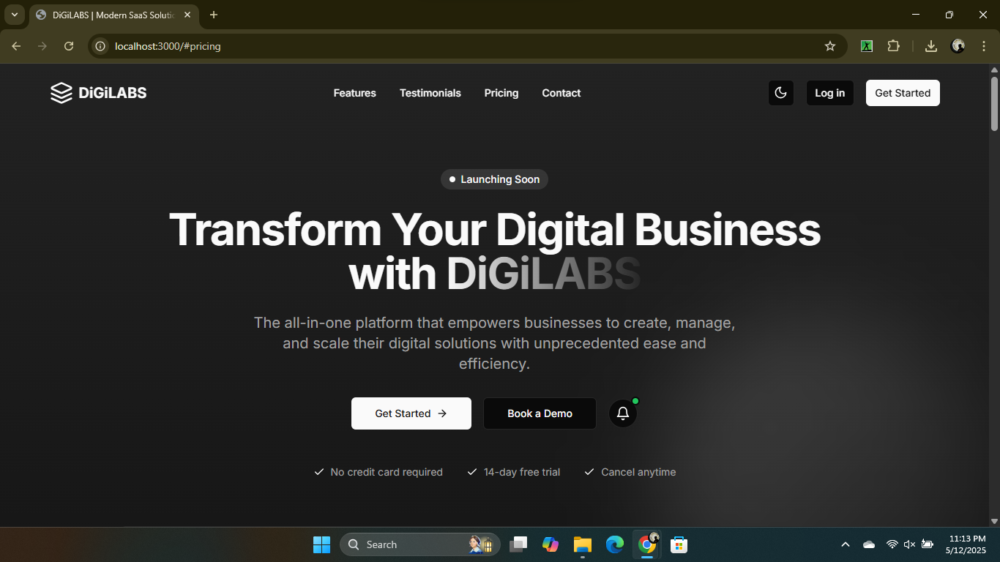
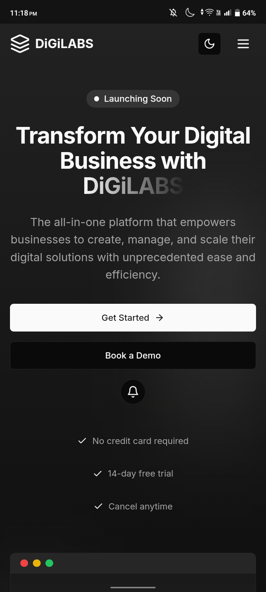

# DiGiLabs

A modern, responsive SaaS landing page built using **Next.js 14**, **Tailwind CSS**, and enhanced with **Progressive Web App (PWA)** support and **push notification** functionality.

## 🔗 Live Demo

👉 [View Live on Vercel](https://digilabs-loc.netlify.app/)  

## ✨ Features

- ⚛️ Built with **Next.js** (App Router)
- 🎨 Styled using **Tailwind CSS**
- 📱 Fully **responsive** design for mobile, tablet, and desktop
- 🔧 Clean and modular **component-based structure**
- 📦 Enabled as a **Progressive Web App** using `next-pwa`
- 🔔 Supports **push notifications** triggered on user interaction
- 🚀 Easily deployable with **Vercel**

## 🖼️ Screenshots

<!-- Add screenshots here -->
<p align="center">
  
  <br/>
  
</p>

## 📁 Folder Structure

```
DiGiLabs/
├── components/        # Reusable UI components (Hero, Features, Footer, etc.)
├── pages/             # Next.js route pages
├── public/            # Static assets, manifest, icons, screenshots
├── styles/            # Global and utility styles
├── next.config.js     # Next.js configuration with PWA
├── manifest.json      # PWA manifest setup
└── README.md          # Project documentation
```

## 🛠️ Getting Started

### 1. Clone the Repo

```bash
git clone https://github.com/ankitrpathak/DiGiLabs.git
cd DiGiLabs
```

### 2. Install Dependencies

```bash
npm install
```

### 3. Run Locally

```bash
npm run dev
```

Visit [http://localhost:3000](http://localhost:3000) to view it in the browser.

## 🧪 Features in Action

- 📲 **PWA**: Add to home screen & offline support
- 🔔 **Push Notifications**: Sends a native browser notification when a button is clicked (ensure notification permission is granted)

## 📌 Tech Stack

- **Framework**: [Next.js](https://nextjs.org/)
- **Styling**: [Tailwind CSS](https://tailwindcss.com/)
- **PWA**: [next-pwa](https://github.com/shadowwalker/next-pwa)
- **Hosting**: [Vercel](https://vercel.com)

## 🙌 Author

**Ankit Raj**  
[GitHub](https://github.com/ankitrpathak)  
[LinkedIn](https://www.linkedin.com/in/ankitrpathak)

---

> If you found this project useful, feel free to ⭐️ the repo and share your feedback!
